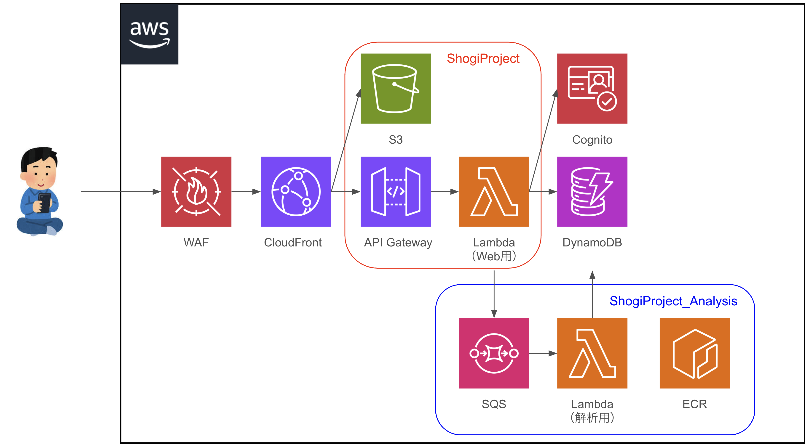

# ShogiProject
## 概要
将棋の棋譜の管理を管理するシステムです。
AIによる局面の解析機能も有しています。

このシステムは本リポジトリと
[ShogiProject_Analysis](https://github.com/h-akira/ShogiProject_Analysis)
2つのリポジトリからなります。
また、フレームワークとして
[hads](https://github.com/h-akira/hads)
を使用しています。

## 構成
本システムはAWS上に構築され、構成図は下記の通りです。
  

## 機能
- 棋譜登録
- 棋譜閲覧
- 棋譜編集
- 棋譜削除
- 棋譜入力（comming soon...）
- タグ機能（comming soon...）
- 棋譜公開（comming soon...）
- 棋譜共有
- エクスプローラー
- AIによる局面解析
- 局面検索機能（検討中）
- 将棋ウォーズ棋譜自動収集機能（検討中）
